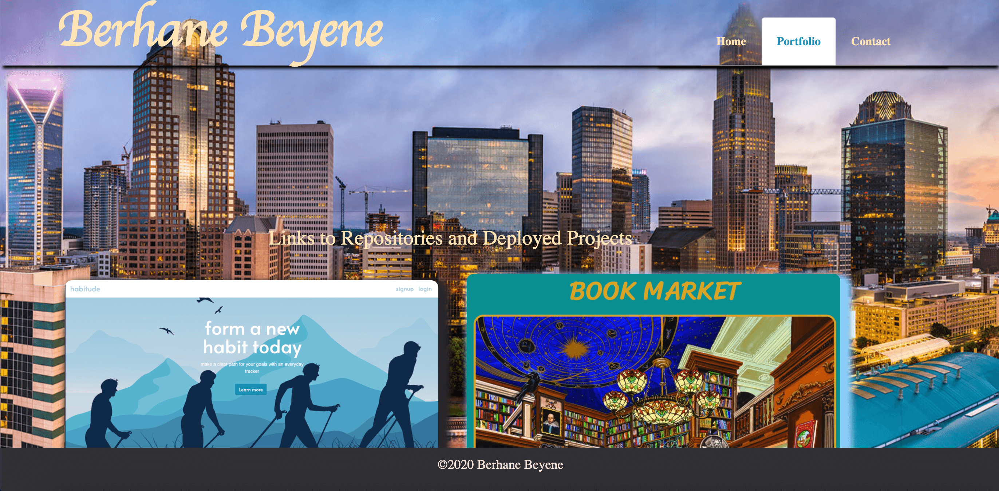

# My Portfolio
It is a web site with my personal information. There are three pages that can be navigated from the nav bar the `home`, `portfolio` and `contact` information. 
1. The home page is loaded with my Image and information about me. 

2. The portfolio page is the location where links to github, linkdin and my resume. Moreover, images of my projects are added and on click to the images will take you to the functional url of the profect.

3. The contact page have my contact information.

# The Link to the my portfolio
URL: https://bbeyenene.github.io/abaut-me/index.html